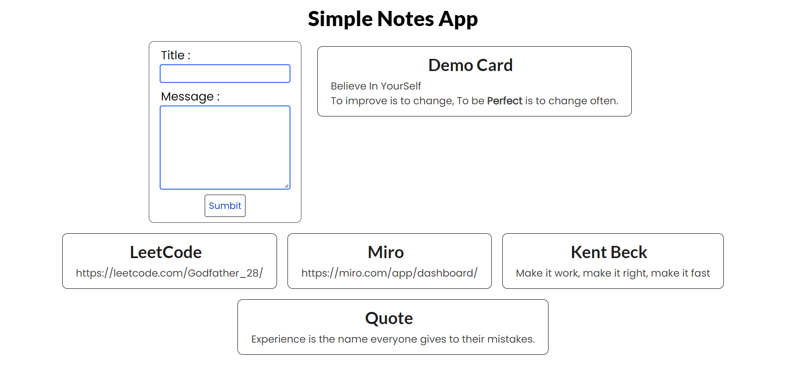

# SvelteJs To-Do List

<div style="border:1px solid black; padding 10px; border-radius:15px; overflow:hidden; box-shadow:4px 4px black;">



</div>
<div style="border:1px solid black; padding 10px; border-radius:15px; overflow:hidden; box-shadow:4px 4px black; margin:30px auto;">


</div>

## Installation

Install To-Do List using

```bash
    git clone https://github.com/SikandarJODD/kit.git
```

## Features

- Single To-Do Can Be Remove
- Seamless UI
- Responsive

## Lessons Learned

- Use Filter to Remove Specific To-Do
- Learn Svelte Js Components
- Created **AddUser**, **FilterUser** and User.svelte..
- Data Passing using **dispatch**


## Run Locally

Clone the project

```bash
  git clone https://github.com/SikandarJODD/kit.git
```

Go to the project directory

```bash
  cd kit
```

Install dependencies

```bash
  npm install
```

Start the server

```bash
  npm run dev
```


